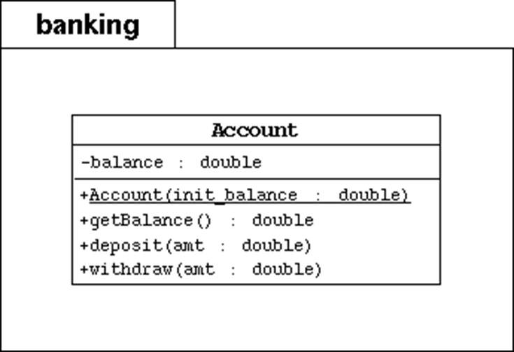
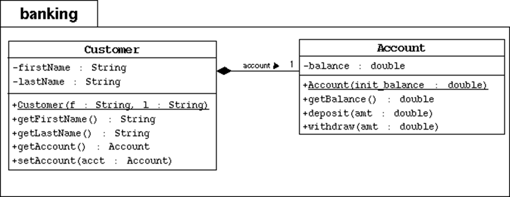
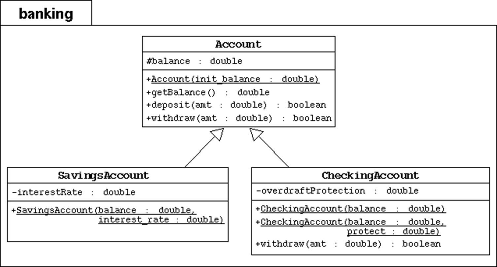
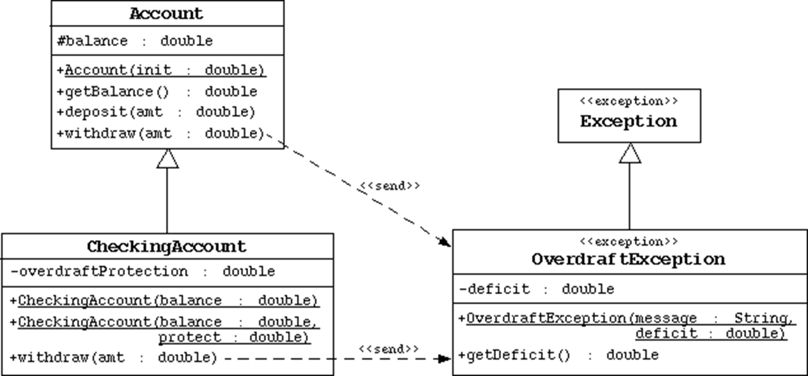

# Pakiet Bankowy #
_Będzie rozwijany przez cały semestr_

## Diagramy UML ##

1. Pakiet i konto

2. Dodajemy klienta, który może mieć wiele kont

3. Dziedziczenie kont

4. Wyjątki

5. Zmiany struktury

